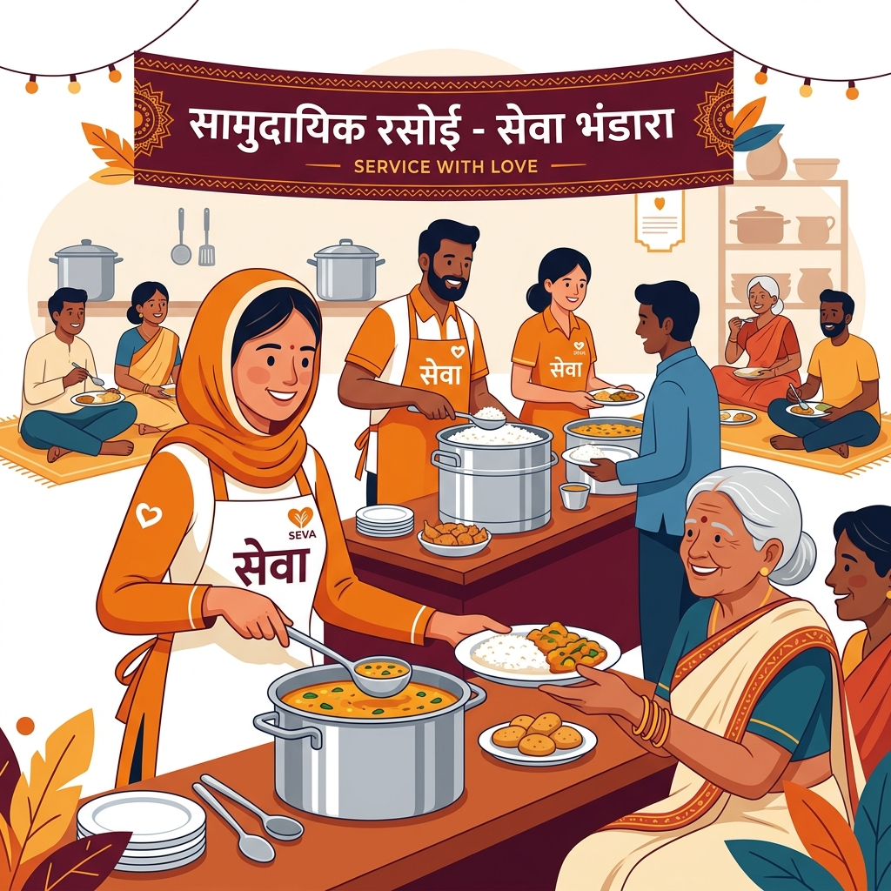
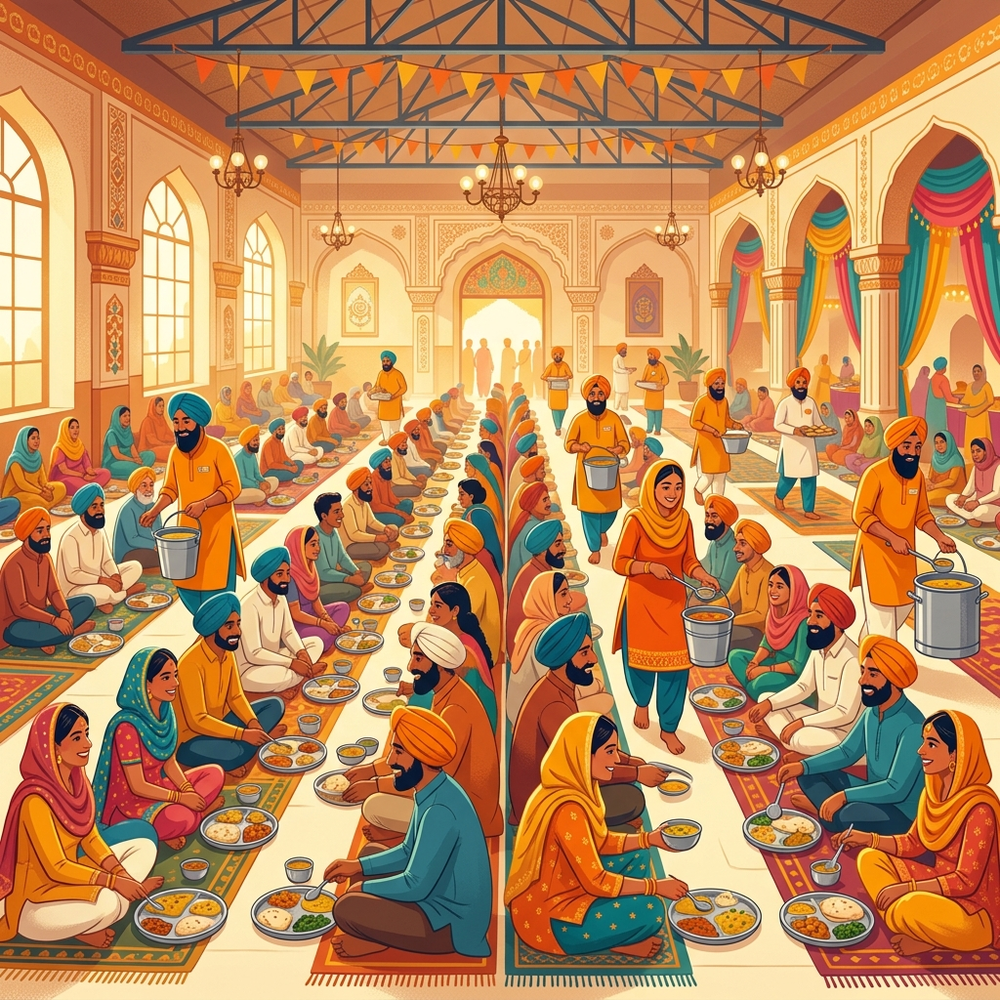

<div align="center">
  
  <h1>BhojanSeva — Food for All</h1>
  <p><strong>A community-driven, open-source platform to locate and share free food distribution services (Bhandaras, Langars, Prasad stalls, Iftar camps) in real-time.</strong></p>
  
  [](https://bhojan-seva-one.vercel.app/)
  [](LICENSE)
  [](https://react.dev)
  [](https://supabase.com)
  
  <br />
  
  <a href="https://bhojan-seva-one.vercel.app/">
    
  </a>
</div>

<br />

## 📖 About BhojanSeva

For centuries, the sacred traditions of *Langar* and *Bhandara* have fed millions across India. **BhojanSeva** digitizes this timeless tradition, ensuring that no one goes hungry by providing a real-time, crowd-verified map of active free food camps.

Whether you're a daily wage worker in need of a meal, a community member looking to volunteer, or an organization wanting to sponsor a Seva, BhojanSeva connects the community through a frictionless, high-utility platform.

---

## ✨ Key Features

| Feature | Description |
| :--- | :--- |
| 🗺️ **Live Interactive Map** | Find active food camps near you. Colored pins denote Live (Green), Running Low (Orange), or Ended (Gray) camps. |
| 🎯 **Dietary Filters** | Instantly filter camps for dietary needs (e.g., Jain, No Onion/Garlic) or check for explicit Allergen warnings. |
| 🎙️ **Vernacular Voice Search** | Built-in voice recognition lets users search in Hindi or English (e.g., "Bhandara near me"). |
| 👥 **Crowd-Verified Accuracy** | Users upvote/downvote listings. Three "Finished" reports within 10 minutes auto-grays a pin to prevent wasted trips! |
| 🚨 **Seva SOS Alerts** | Organizers with surplus food can trigger an SOS beacon to alert nearby NGOs and volunteers for immediate collection. |
| 💰 **Sponsor a Seva (CSR)** | Direct UPI QR code integrations for users and corporations to fund community kitchens transparently. |
| 📱 **Progressive Web App (PWA)** | Installable directly on any mobile phone with offline caching and service workers for low-bandwidth usage. |
| 🎪 **Festival Route Mode** | An optimized routing mode that draws a path connecting multiple major food camps during city-wide festivals. |

---

## 📸 Platform Previews

<div align="center">
  <table>
    <tr>
      <td align="center">
        <strong>The Map View</strong><br/>
        
      </td>
      <td align="center">
        <strong>Host Dashboard</strong><br/>
        
      </td>
    </tr>
  </table>
</div>

---

## 🛠️ Technology Stack

BhojanSeva is built using modern, highly scalable, and open-source technologies:

| Layer | Technology | Details |
| :--- | :--- | :--- |
| **Frontend** | React 18, Vite | Lightning-fast HMR and optimized production bundling. |
| **Styling** | Vanilla CSS, Lucide Icons | Clean, responsive, Glassmorphic UI without bloated CSS frameworks. |
| **Mapping** | React Leaflet, OpenStreetMap | Free, open-source tile layer mapping with dynamic custom markers. |
| **Backend & Auth** | Supabase | Instant PostgreSQL API, Auth, and Storage. |
| **Geospatial Queries** | PostGIS | High-performance coordinate radius searching natively in PostgreSQL. |
| **Deployment** | Vercel | Global edge network for zero-latency static hosting. |

---

## 🚀 Running Locally

Ready to contribute or run your own instance? Follow these steps:

### 1. Clone the repository
```bash
git clone https://github.com/Ritik639471/BhojanSeva.git
cd BhojanSeva
```

### 2. Install dependencies
```bash
npm install
```

### 3. Set up Environment Variables
Create a `.env` file in the root directory and add your API keys:
```env
VITE_SUPABASE_URL=your_supabase_project_url
VITE_SUPABASE_ANON_KEY=your_supabase_anon_key
VITE_GEMINI_API_KEY=your_google_gemini_api_key
```

### 4. Database Setup
Go to your [Supabase Dashboard](https://supabase.com/dashboard) and open the SQL Editor. 
Copy the contents of `supabase_schema.sql` and run it. This will automatically set up the `sevas` table, Row Level Security (RLS) policies, and the necessary PostGIS `get_sevas_near` function.

### 5. Start the Dev Server
```bash
npm run dev
```
Open `http://localhost:5173` in your browser.

---

## 🤝 Contributing

We welcome contributions from developers, designers, and community organizers!
1. Fork the repository
2. Create a Feature Branch (`git checkout -b feature/AmazingFeature`)
3. Commit your changes (`git commit -m 'Add some AmazingFeature'`)
4. Push to the Branch (`git push origin feature/AmazingFeature`)
5. Open a Pull Request

---

## 📜 License

This project is licensed under the MIT License - see the [LICENSE](LICENSE) file for details.

<div align="center">
  <p>Made with ❤️ for the community.</p>
</div>
